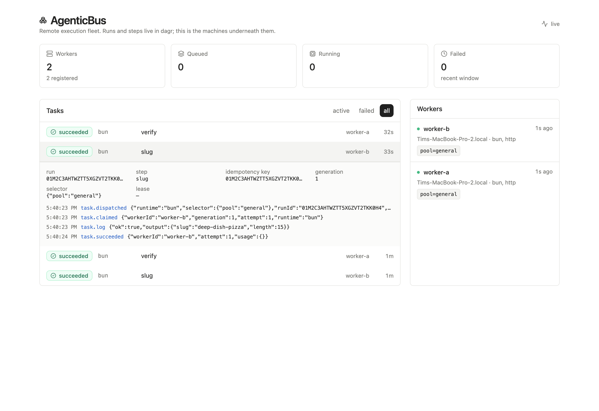

# AgenticBus

Distributed execution for [dagr](https://github.com/TimMikeladze/dagr) workflows. dagr owns the graph — twelve step kinds, status-aware joins, human gates, questions, resource governance — and runs one process against one SQLite journal. AgenticBus moves the *handlers* off that machine: a step declares `runtime: remote`, a worker on another host claims it, and the engine gets the result back with leases, heartbeats and generation fencing in between.

```yaml
review:
  kind: task
  runtime: remote
  with:
    run: agent                      # the runtime the remote worker executes
    select: { pool: gpu }           # must match that worker's labels
    input:
      prompt_file: ./prompts/review.md
      model: claude-opus-5
```

That step now runs on a box with a GPU, and everything else about the workflow is unchanged.

## Why this exists

dagr's spec is explicit that multi-process execution is not coming:

> Running a second OS process against the same database file is **not supported** … There is no cross-process claim arbitration, no distributed lock, and no leader election.

That is the right call for dagr — the single writer is load-bearing for three separate invariants — and it leaves a real gap. AgenticBus fills exactly that gap and nothing else. The engine stays the only writer of its journal; remote workers never open it. They hold leases over HTTP, which is a problem the broker is allowed to solve because it is the broker's own database.

The result is that **every dagr step kind works**, because the graph is executed by dagr's engine. Nothing here re-implements joins, retries, gates, `foreach`, sub-workflows, or the expression language.

## Install

Bun 1.4+. dagr is not on npm yet, so it resolves from a sibling checkout:

```sh
git clone https://github.com/TimMikeladze/dagr ../dagr && (cd ../dagr && bun install)
bun install
bun run build          # the fleet dashboard
```

## Run it

```sh
bun run dev
```

That starts the engine host, the broker, two worker processes and the dashboard, choosing free ports rather than fighting for taken ones. Then:

```sh
ENGINE_URL=http://127.0.0.1:4318 bun scripts/run.ts remote-slug '{"text":"Crème brûlée"}'
```

```
run 01M2C384JD2WKF8B5R1A8254SW
  running      slug
  succeeded    slug
  running      verify
  waiting      gate
    approve with: curl -sX POST …/signals -d '{"name":"slug.approved","correlation":"01M2…"}'
  succeeded    verify
```

The `slug` and `verify` steps ran in separate OS processes that never touched the engine's database. `gate` is a dagr `approval` step, parked until somebody signals it.



## The pieces

| Command | What it is |
| --- | --- |
| `agenticbus serve` | Single box: dagr's engine, the broker, and dagr's control plane, in one process. |
| `agenticbus broker` | The broker alone, for a split deployment. |
| `agenticbus worker` | A remote worker hosting dagr's runtimes. |
| `agenticbus token` | Mint a per-worker capability token. |
| `agenticbus status` | Fleet and queue readout. |

### Split across machines

```sh
# Wherever the workers can reach it:
agenticbus broker --port 4317

# The engine host, dispatching into that broker rather than embedding one:
agenticbus serve --broker-url https://bus.internal:4317 --workflows ./workflows

# Any number of worker machines:
BUS_TOKEN=… agenticbus worker --broker https://bus.internal:4317 --runtimes bun
```

Three processes, three machines, one workflow. The engine still owns its journal alone; the broker owns its own; the workers own neither.

`serve` listens on two ports: the broker (`--port`, default 4317) and dagr's control plane (`--engine-port`, default broker + 1), both behind the admin token. dagr ships its control plane unauthenticated by default and says so in its docs; this host does not expose it bare.

### A worker

```sh
# On the engine host — mint a credential scoped to one worker:
agenticbus token --worker gpu-1 --runtimes agent,bun --labels pool=gpu

# On the worker machine:
BUS_TOKEN=<that token> agenticbus worker \
  --id gpu-1 --broker https://bus.internal \
  --runtimes agent,bun --labels pool=gpu \
  --jobs ./jobs --agent-cwd ./work --agent-models claude-opus-5
```

The worker hosts **dagr's own executors** — `bunExecutor`, `shellExecutor`, `httpExecutor`, `pythonExecutor`, `agentExecutor`, `promptExecutor`. A remoted `bun` step runs the same code it would have run in-process, with the same default-deny allowlists and the same subprocess kill discipline. Runtime parity is structural, not maintained by hand.

Registration is default-deny in both directions: a worker serves only the runtimes named in `--runtimes`, and its token can withhold even those.

## What the broker adds

Everything a network needs that a single process does not.

- **Idempotent dispatch** on dagr's `${runId}:${stepKey}`. A re-dispatched step reattaches to remote work in flight instead of starting a second copy.
- **Reattach after an engine crash.** The executor checkpoints the task id before it waits, so a reclaimed attempt resumes watching a remote process that never stopped — the same trick dagr's agent runtime uses for session ids.
- **Leases that arbitrate, not just recover.** A worker that dies mid-step loses its lease; the task returns to the queue and another machine finishes it, up to `maxAttempts`. dagr keeps leases only for crash recovery, because it has nothing to arbitrate against.
- **Generation fencing.** A completion from a worker whose lease has moved on is rejected, not applied.
- **Duplicate-safe completion.** The worker keeps an on-disk outbox, so a finished computation survives a broker outage; a replay of the same result is accepted, a *different* result for the same task is a conflict.
- **Heartbeats paced by the lease.** The broker tells the worker how long its lease is and the worker beats three times inside it, so shortening the lease cannot silently break the fleet.
- **Usage passthrough.** Workers report `costMicros` and token counts, so a remoted agent step still spends the run's resource grant.

## HTTP API

| Method | Path | |
| --- | --- | --- |
| `GET` | `/health`, `/ready` | liveness; readiness names a stale fleet |
| `POST` | `/api/tasks` | dispatch (admin) |
| `GET` | `/api/tasks/:id` | one task |
| `POST` | `/api/tasks/:id/cancel` | ask a worker to stop (admin) |
| `POST` | `/api/tasks/:id/heartbeat` `/complete` `/progress` `/checkpoint` `/log` | worker lifecycle |
| `POST` | `/api/workers/register`, `/api/workers/:id/claim` `/pause` | worker lifecycle |
| `POST` | `/api/tokens` | mint a worker token (admin) |
| `GET` | `/api/snapshot` `/api/events` `/api/events/stream` `/api/workers` `/api/usage` | observation |

Runs, steps, asks, signals and schedules are dagr's API, served on the engine port.

## Security

**Per-worker tokens.** The broker holds a signing key and mints HMAC-SHA-256 tokens carrying `{ workerId, runtimes, labels, expiry }`. A token cannot claim work outside its runtimes, cannot advertise labels it was not issued for, and cannot act as another worker. Verification is stateless, so revocation is by expiry or key rotation rather than a lookup on the hot path.

**Three scopes.** `admin` dispatches, cancels and mints. `worker` claims and completes. `reader` is read-only, minted per page load and injected into the dashboard, so a page that can be opened is not a page that can dispatch work.

**The signing key and admin token live in `.agenticbus/` at mode 0600**, not in argv where `ps` would show them.

**Transport is the operator's job.** A bearer token must not cross an untrusted network in plaintext: terminate TLS or use an encrypted tunnel. A reverse proxy in front of the dashboard must authenticate its own users.

**Secrets and the wire.** dagr resolves `${{ secrets.X }}` while materializing a step, so a secret written into a remote step's `with` is resolved on the engine and shipped to the worker. Keep it out of `with` and let the runtime read it on the worker instead — `agenticbus worker --secrets NAME,NAME` is the allowlist for that.

**Workers run handler code as their own user.** `agent`, `shell`, `bun` and `python` steps reach the worker host's filesystem — the agent runtime most of all, since a writing permission mode hands it the disk. A child process is a crash boundary, not a sandbox. Run untrusted definitions on workers that register only `http`, or put each worker in a container or VM. This is dagr's posture, inherited deliberately.

## Verify

```sh
bun run typecheck
bun test tests
bun run build
bun run test:e2e
```

The end-to-end check is real processes and no mocks: it starts the engine host and two worker processes, runs a workflow with a slow remote step, **SIGKILLs the worker holding that step**, and asserts that the lease expires, another machine finishes the work, the journal records the expiry, the human gate parks and settles on a signal, and re-dispatching a finished key reattaches instead of duplicating.

It then does the same for the split deployment — a standalone broker, an engine host pointed at it with `--broker-url`, and a worker that knows about neither database.

```
ok   engine host and broker are up
ok   two independent worker processes registered
ok   killed worker-b while it held slow
ok   a surviving worker recovered the expired lease — attempt 2, now on worker-a
ok   the journal recorded the lease expiry
ok   the run parked on its approval gate
ok   the run succeeded end to end — succeeded
ok   the workflow output carries the remote result — {"slug":"creme-brulee"}
ok   re-dispatching a finished key reattaches instead of duplicating
ok   a broker and an engine host started as separate processes
ok   readiness fails while no worker has checked in
ok   the run succeeded across three separate processes — succeeded
```

## CI

`examples/ci-gate.ts` gates a merge on a workflow. It keys the run on the commit SHA — so re-running the job reuses the run instead of paying for the remote steps twice — and exits **0** succeeded, **1** failed, **2** waiting on a person, **3** timed out.

```sh
ENGINE_URL=https://bus.internal:4318 bun examples/ci-gate.ts \
  --workflow review --input "{\"sha\":\"$GITHUB_SHA\"}"
```

## Boundaries

The broker is an availability boundary, as the engine host is. Cancel stops acceptance of results and asks workers to stop on their next heartbeat; it does not undo work already done.

Two attempt counters exist and mean different things. The **broker's** attempts recover a dead worker. The **engine's** `retries` re-run a step that genuinely failed. A `fatal` failure from a worker skips broker retries entirely and goes straight back to dagr's policy.

One broker process writes the broker's database, exactly as one engine process writes dagr's. Replicating either is not implemented.

## Design

- [Distributed execution for dagr workflows](docs/superpowers/specs/2026-09-12-distributed-execution.md) — the current design and why it is shaped this way.
