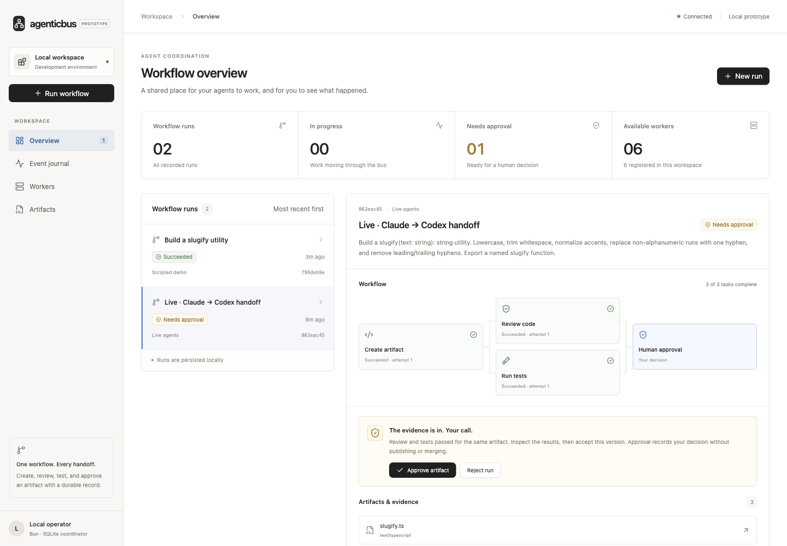

# AgenticBus

A working Bun prototype for coordinating agents through durable tasks, artifacts, and events. Create a workflow in the dashboard, watch independent workers claim tasks, inspect their outputs, and approve the result.

The UI takes inspiration from `../reportable`: shadcn Base UI controls, a warm neutral sidebar, compact typography, subtle borders, and small radii.



## Run locally

Requires Bun 1.4 or newer. From this directory:

```sh
bun install
bun run dev
```

Open **http://localhost:5173**. This starts a Bun coordinator on loopback port 4317, the Vite dashboard, and six independent workers (three scripted demo workers and three live-mode workers). Stop them together with Ctrl+C.

Create a **Scripted demo** run to exercise the whole system without model calls. It generates a TypeScript slug utility, passes the exact artifact to review and testing workers, runs six real Bun tests, and waits for human approval. Approval accepts the artifact in the bus; it does not merge code or publish anything.

Choose **Live agents** to use your installed, authenticated `claude` and `codex` CLIs. Claude creates the source, Codex reviews it, and Bun executes the same test contract. Live runs consume your provider usage. No model calls happen merely by opening the dashboard or starting idle workers. The creator has a $1 CLI budget setting; the whole workflow has no hard aggregate dollar cap. Both provider calls have a three-minute execution deadline.

The prototype deliberately fixes the artifact contract to `slugify(text: string): string`. The brief can refine requirements; this is not yet a general arbitrary-project coding environment.

## What is real

- SQLite WAL journal, task state, approvals, worker registration, and artifact storage.
- Separate worker processes communicating over authenticated HTTP, not UI timers.
- Parallel review/test tasks sharing an immutable artifact ID and SHA-256 digest.
- Expiring leases, monotonic generations, rejection of stale completions, three-attempt recovery, and duplicate-safe completion.
- A live event timeline via SSE invalidation, searchable recent events, and inspectable artifacts.
- Pause/resume worker intake, stop runs, and retry stopped workflows as new runs.
- Observation hook ingestion with a local spool for coordinator outages.
- CLI adapters exercised with Claude Code 2.1.269 and Codex CLI 0.154.0; Bun 1.4.0.

## Remote workers

The runner uses the same API on another machine. Keep the coordinator running on a reachable host, clone this repository on the worker, and install Bun/dependencies there. Supply the shared prototype token through `BUS_TOKEN`. `bun run dev` stores its local token in `.prototype/worker-token`; treat that file as a credential and transfer it privately.

```sh
# On a worker with BUS_TOKEN already set:
BUS_URL=https://your-coordinator.example bun run worker --role reviewer --mode live --id remote-codex
```

Roles are `creator`, `reviewer`, and `tester`; modes are `demo` and `live`. Every worker needs a unique ID. An alternative is an SSH tunnel to the coordinator's loopback port; point `BUS_URL` at the local forwarded port. This avoids exposing the coordinator directly.

For a standalone coordinator, set `BUS_TOKEN` and run:

```sh
bun run build
bun run server
```

This serves the built dashboard on http://127.0.0.1:4317. `PORT`, `BUS_DB`, and `BUS_HOST` configure the listener/database. Non-loopback API requests require bearer authentication; the dashboard's current operator session is local-only. Use an SSH tunnel for remote operator access, or add a proper login/reverse-proxy integration before remote browser deployment. Direct HTTP bearer tokens must not cross an untrusted network: use HTTPS termination or an encrypted tunnel. A reverse proxy that rewrites Host to localhost must enforce operator authentication itself.

Independent HTTP workers and reconnection are tested on one host. A physical two-machine deployment has not been verified in this workspace.

## Hook observations

The hook bridge reads provider JSON from stdin, spools it, and publishes an observation. For the local dev coordinator:

```sh
BUS_TOKEN="$(cat .prototype/worker-token)" bun scripts/hook.ts <<'JSON'
{"hook_event_name":"PostToolUse","tool_name":"Bash","tool_result":"Tests passed"}
JSON

# Retry observations retained while the coordinator was unavailable:
BUS_TOKEN="$(cat .prototype/worker-token)" bun scripts/hook.ts --flush
```

This is an **observation-only** bridge. It writes no provider decision JSON to stdout, does not install hooks into your personal configuration, and cannot veto a tool. Spool replay keeps event IDs stable, but separate provider reinvocations get separate IDs. Run from this repository so the prototype spool is in the expected directory.

## Verify

```sh
bun run typecheck
bun test tests
bun run build
bun run test:e2e
```

The end-to-end check starts an isolated coordinator and real worker processes, kills the first creator, verifies lease recovery by a replacement, runs the artifact's tests, deduplicates a hook event, reopens the SQLite store, and completes approval over HTTP. Scratch test data is removed afterward.

## Prototype boundaries

The system assumes trusted developer-owned machines and one workspace. The token grants all worker operations; it is not a per-worker capability credential. Local loopback callers can operate the dashboard API. Do not expose this as a multi-tenant service.

Generated TypeScript is executed in a temporary subprocess with a reduced environment and a timeout. That is **not an OS sandbox**: code still runs as your user. Only run live artifacts in a machine/environment where you accept that trust, or place test workers in an isolated container/VM.

The coordinator remains one availability boundary. Cancel stops acceptance of task results immediately and asks active workers to stop on their next heartbeat; it does not undo work already done. Only retry-safe computations are supported. A new run retry gets a new identity and can incur fresh provider usage.

SQLite artifacts are suitable for this small demo; the production design calls for an external artifact service. The dashboard snapshot shows the latest 100 journal events; `/api/events?after=<seq>` pages through older events in batches of 1,000. SSE is a refresh signal, not a durable subscription acknowledgement. Disk retention, production broker replication, task reconciliation for external effects, MCP/A2A gateways, and synchronous policy enforcement remain roadmap work.

Scratch state and tokens live under `.prototype/` and are excluded from Git. Source and tests are committed; no credentials, runtime databases, or installed dependencies are pushed.

## Design and research

- [Architecture, diagrams, workflows, and long-term roadmap](docs/superpowers/specs/2026-09-11-agenticbus-design.md)
- [Prototype refinements and implementation plan](docs/superpowers/plans/2026-09-11-e2e-prototype.md)
- [Claude and Codex integration research](docs/research/agent-integrations.md)
- [Bun, messaging, and protocol research](docs/research/bus-foundations.md)

The architecture proposal is the long-term specification. Its illustrative `agenticbus` CLI commands are not the commands for this prototype; use the Bun scripts above.
