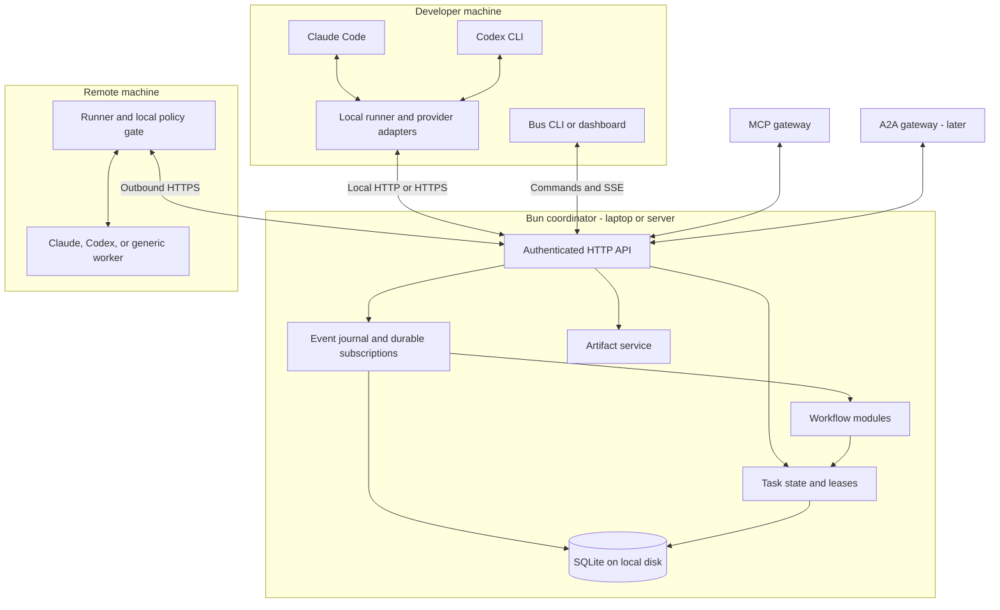
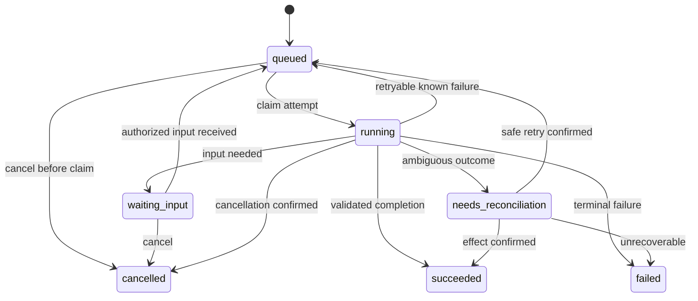
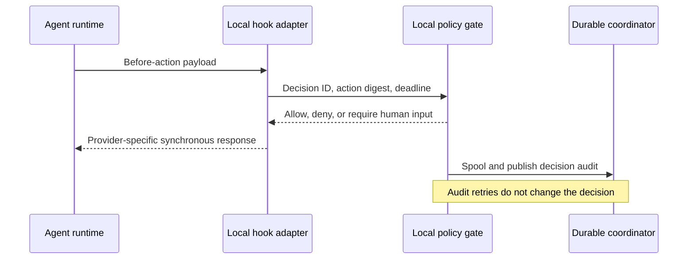
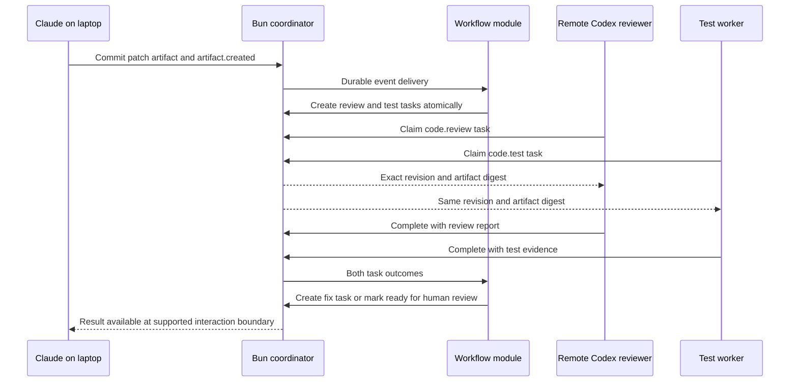

> **Superseded (2026-09-12).** This described a standalone coordinator with its own fixed workflow. That design is gone: the graph now belongs to [dagr](https://github.com/TimMikeladze/dagr) and AgenticBus is the distributed execution layer around it. See [2026-09-12-distributed-execution.md](2026-09-12-distributed-execution.md). Kept for the reasoning on contracts, delivery semantics and recovery, which carried forward.

# AgenticBus: Bun architecture proposal

Status: long-term architecture proposal, with an end-to-end prototype now implemented. See the [prototype plan](../plans/2026-09-11-e2e-prototype.md) and [README](../../../README.md) for its narrower implemented contracts and runnable commands.

Date: 2026-09-11. Scope confirmed by the user: Claude and Codex collaborating both on one machine and across multiple machines. The workspace began empty; installed Bun is 1.4.0. Provider documentation is evolving, so adapters need recorded compatibility checks.

## 1. What we are building

The first prototype refines the workflow into artifact creation, parallel review and executable tests, then an explicit human acceptance decision. It uses both scripted workers and real Claude/Codex CLI adapters, with a Reportable-inspired dashboard. Implemented recovery covers retry-safe computation; distributed high availability and side-effect reconciliation remain roadmap features. The design below describes the broader target, not claims that every subsystem is already implemented.

A durable coordination layer connecting agents, tools, and humans. An agent can announce a result, request another agent's capability, wait for input, and resume after a disconnection. Operators can inspect who requested work, what ran, what artifacts it produced, and why it stopped.

The bus transports and records work. Workflow modules decide what should happen next. Provider adapters translate between our contracts and each agent runtime. This keeps a future model, language, or transport change from rewriting the workflow system.

The first useful workflow is: Claude produces a patch on a laptop, a remote Codex worker reviews the exact patch, a test worker validates it, and the initiating agent receives the results. Every step has durable identity. A restarted dashboard or disconnected laptop does not erase accepted work.

## 2. Three approaches

| Approach | Good fit | Tradeoff |
| --- | --- | --- |
| **Bun coordinator + SQLite + remote runners — recommended** | One developer and a small fleet; simple installation and inspectable state | One coordinator is an availability boundary; we own queue correctness and must test it carefully |
| **Bun services + JetStream + transactional task store** | Teams needing replicated transport and independently scaled workers | More services and a dual-write problem to solve with outbox/inbox transactions |
| **Direct peer-to-peer agent connections** | Temporary experiments with little durable coordination | Discovery, partitions, ownership, replay, and policy become responsibilities of every peer |

JetStream provides persistence and redelivery that Core NATS does not. It is a reasonable later backend, or a day-one choice if high availability is already required. [NATS documentation](https://docs.nats.io/concepts/jetstream)

Choosing SQLite does not restrict workers to one machine: only the database itself stays on one host. Remote workers use the API. [SQLite WAL constraints](https://sqlite.org/wal.html)

## 3. Architecture



Deploy the same coordinator on the laptop for entirely local use, or on a reachable server so remote work continues while the laptop sleeps. A laptop-hosted coordinator going offline pauses new claims and authoritative updates. Runners spool observations locally; they do not elect themselves independent schedulers.

Remote runners initiate outbound connections, so they do not need publicly reachable ports. Local API binding defaults to loopback with authentication; the remote profile requires HTTPS and worker credentials scoped to a workspace and capability. No SQLite file on a network share.

## 4. Three distinct contracts

| Contract | Meaning | Example | Success means |
| --- | --- | --- | --- |
| **Event** | An immutable observation | `dev.agenticbus.artifact.created.v1` | Coordinator durably accepted the fact |
| **Task command** | A request with an owner and lifecycle | Review artifact A using capability `code.review` | Task accepted; completion arrives separately |
| **Decision request** | A deadline-bound question before an action | May this tool execute with these inputs? | A matching, unexpired decision was returned |

Messages are the transport envelopes carrying these contracts. A hook is a provider's lifecycle interception point, not a delivery guarantee. `PostToolUse` can report a tool result; it cannot prevent the tool call that already happened. An async notification must never be treated as a synchronous permit.

Do not wake every agent for every event. Durable subscriptions deliver relevant facts to deterministic workflow modules. Modules create targeted tasks. Live token/progress deltas use a separate bounded, lossy channel; task terminal states and artifact references are durable.

## 5. Protocol and identity

Use CloudEvents 1.0 JSON for published facts, with versioned JSON Schemas for payloads. Its envelope and extension rules provide a useful common format; routing, authorization, and delivery remain our contract. [CloudEvents specification](https://github.com/cloudevents/spec/blob/v1.0.2/cloudevents/spec.md)

Illustrative proposed event, not an existing API response:

```json
{
  "specversion": "1.0",
  "id": "01-event-review-completed",
  "source": "urn:agenticbus:worker:reviewer-7",
  "type": "dev.agenticbus.review.completed.v1",
  "subject": "tasks/review-42",
  "time": "2026-09-11T20:00:00Z",
  "datacontenttype": "application/json",
  "workspaceid": "repo-17",
  "taskid": "review-42",
  "correlationid": "workflow-8",
  "causationid": "urn:agenticbus:message:coordinator:request-41",
  "data": {
    "artifactId": "artifact-patch-9",
    "verdict": "changes_requested",
    "reportArtifactId": "artifact-report-10"
  }
}
```

Keep the identities distinct:

- Agent identity describes a logical worker; runner identity describes the authenticated process/host connection.
- Provider session ID identifies a Claude/Codex conversation; it is not a task ID.
- Task ID survives attempts. Attempt ID changes for each execution. Lease generation changes for every reassignment.
- Event identity is `(source, id)`. A globally unique message reference encodes both for causation; correlation groups a workflow. Trace context is supplemental.
- Workspace identity is an opaque project identifier. Each runner maps it to a permitted local checkout, never to a sender-selected arbitrary path.

The coordinator validates that credentials permit the claimed source/workspace. It records authenticated provenance separately from producer-supplied text. A claimed capability such as `code.review` is discovery metadata, not a permission grant.

Artifacts contain immutable bytes plus digest, media type, size, producer, and source revision. Store large patches, logs, images, and future modalities outside message bodies. Use an authenticated artifact API; never ask a remote machine to open a laptop's absolute path. Upload bytes and verify their digest before committing an event referencing them. Garbage-collect unattached uploads after a grace period.

## 6. Delivery, state, and recovery

The v1 store owns `events`, `subscriptions`, `deliveries`, `tasks`, `attempts`, `runners`, `decisions`, `artifacts`, and idempotency records. A single coordinator serializes mutations. Within a short transaction, accept a task command, write its initial task state, and append the accepted event. Never hold a transaction open during an agent call.

The SQLite configuration uses WAL and `synchronous=FULL` for durable acceptance. This still depends on filesystem/hardware sync behavior and does not provide host-loss replication. Bun supplies the SQLite primitives; the semantics below are ours to implement. [Bun SQLite](https://bun.com/docs/runtime/sqlite), [SQLite durability](https://sqlite.org/wal.html)

**Publish:** A producer persists an event identity before retrying. The coordinator returns a receipt only after commit. Duplicate `(source, id)` with the same canonical content returns the original receipt; the same identity with different content is a conflict. Reject unauthorized/oversized input before persistence. Durable acceptance does not imply any consumer executed.

**Subscriptions:** Each subscription is an independent durable consumer. Instances sharing a subscription compete for its deliveries; different subscriptions each receive the event. A transactional scanner advances a subscription's scan cursor only while creating all matching delivery rows, so a crash cannot skip a matching event. Delivery IDs are unique per subscription/event. Completion acknowledges each delivery independently; a slow message must not be skipped by a later cursor.

**Task claims:** A worker long-polls with capability, workspace, and capacity. The coordinator atomically issues a lease, attempt ID, and increasing fencing generation. It records heartbeats and only accepts completion from the current owner/generation. A repeat of an already-committed completion returns its original receipt; conflicting results are rejected. The runner saves task-to-provider-session mappings durably.

**Crash recovery:** If a worker disappears, lease expiration marks the attempt uncertain. The coordinator first reconciles its saved provider session where possible. Retry-safe tasks can be reassigned; an ambiguous external side effect becomes `needs_reconciliation`. A lease cannot stop an already-running process. Fencing protects only stores and tools that actually validate it.

**External effects:** “Publish PR” or “deploy” workers must use a downstream idempotency key or verify the downstream result before retrying. An event acknowledgement cannot make an external effect exactly once. An inbox check that is separate from the effect also cannot close the crash window. For internal workflow transitions, apply state changes, emitted commands, and inbox acknowledgement in one transaction.

**Ordering:** The local journal has an ingestion position; it does not claim global causal order among remote agents. Use task state versions and conditional transitions for correctness. Timestamps do not decide ownership. Serialize a subscription's processing per task when order matters, while allowing other tasks to progress.

**Retries and bounds:** Exponential backoff with jitter, maximum attempts, deadlines, workspace queue limits, and per-runner credit. Poison deliveries go to a dead-letter view. Expose manual retry with the original operation identity. Reject excess durable traffic explicitly; never silently drop it. Token deltas can be sampled/coalesced with visible gap markers.

**Retention:** Proposed defaults are 30 days for completed-task events/artifacts and 90 days for deduplication tombstones. Active tasks pin required records. The advertised retry horizon must not exceed tombstone retention; older retries require reconciliation. Expired replay cursors return an explicit gap and snapshot recovery path. Backups must include artifacts and a consistent SQLite backup, with restore checks.



Cancellation is a request until the runner confirms stopping or reconciliation establishes the outcome. Deadlines use the same cancellation/reconciliation rules. Waiting for human input relinquishes execution capacity and fences the old attempt; it does not keep a paid model invocation alive indefinitely. Heartbeat freshness is liveness evidence, not proof of useful progress.

## 7. Hook and provider adapter boundaries

Each adapter reports supported operations after a version/handshake probe: observe lifecycle, launch, resume, supply input, interrupt, and synchronous decision coverage. An unsupported operation returns an explicit error. Preserve unfamiliar provider events in a namespaced payload without guessing a stronger canonical meaning. Raw payload capture is opt-in and redacted.

An attached interactive CLI is different from a runner-owned process. Hooks can observe the former where installed; the bus must not promise arbitrary prompt injection into an already-open terminal. Dependable task dispatch uses a runner-owned CLI or supported SDK/app-server session. See [current provider research](../../research/agent-integrations.md) for exact surfaces and caveats.

Use Claude Agent SDK streaming for owned interactive sessions, and Codex app-server over worker-local stdio for comparable control. Finite CLI jobs can use structured non-interactive output. Both providers now document native hooks, but their decision vocabularies and coverage differ. In particular, the documented Codex pre-tool `ask` value is unsupported and can let execution continue after hook failure; translate decisions explicitly. [Claude streaming input](https://code.claude.com/docs/en/agent-sdk/streaming-vs-single-mode), [Codex app-server](https://learn.chatgpt.com/docs/app-server), [Codex hooks](https://learn.chatgpt.com/docs/hooks)



Keep policy evaluation local and deterministic for tool-time decisions. A human decision becomes a durable waiting task; deny/defer the current action and reissue after approval unless that provider explicitly supports a safe wait. Bind approvals to task, action digest, workspace, policy version, and expiration. Do not reuse approval after inputs change.

For a missing or unhealthy gate, protected actions are denied by our supported adapter path. Providers may have hook failures that permit continuation or tools outside hook coverage; then hooks cannot enforce that policy. Required controls live in the actual tool gateway, runtime sandbox, filesystem permissions, and credential boundary. The bus cannot manufacture enforcement that a host does not provide.

Observational hooks persist to a bounded local spool before returning where feasible. Report `accepted_locally` distinctly from `committed` at the coordinator. Provider events that lack stable invocation identity may not be perfectly deduplicated across hook reinvocation; advertise that limitation. Task commands use independently stable idempotency keys.

## 8. Bun implementation shape

Proposed modules, not scaffolded packages:

| Module | Responsibility | Depends on |
| --- | --- | --- |
| `protocol` | Schemas, identities, error codes, capability negotiation | Language-neutral specification |
| `store` | Atomic state transitions, journal, subscriptions, leases | `bun:sqlite` initially |
| `coordinator` | Authenticated API, scheduling admission, subscriptions | Protocol and store |
| `runner` | Durable spool, process/session lifecycle, heartbeats | Protocol, artifact client, provider adapters |
| `adapters/claude`, `adapters/codex`, `adapters/stdio` | Provider framing and semantics | Their declared provider version |
| `policy` | Local decisions and approval validation | Versioned trusted configuration |
| `workflows` | Rules, fan-out/join, budgets, escalation | Public task/event contracts |
| `cli`, `mcp` | Human and agent access to public operations | Coordinator client |

Use `Bun.serve` for HTTP and streaming, `Bun.spawn` with argument arrays for processes, and the Bun test runner for invariants. Drain both output streams; bound JSONL frames; handle partial frames, malformed input, process exit, and cancellation. The storage owner can live in a Bun Worker to isolate synchronous SQLite calls from the network/policy event loop. [Bun serving](https://bun.com/docs/runtime/http/server), [Bun subprocesses](https://bun.com/docs/runtime/child-process)

Proposed public operations:

| Operation | Semantics |
| --- | --- |
| `POST /v1/events` | Commit a fact; return duplicate-safe receipt |
| `POST /v1/tasks` | Validate authority/capability and persist an idempotent request |
| `GET /v1/tasks/:id` | Read authoritative lifecycle and artifact references |
| `POST /v1/tasks/:id/cancel` | Record cancellation intent |
| `POST /v1/claims` | Long-poll for leased work with credit |
| `POST /v1/attempts/:id/heartbeat` | Renew current owner/generation lease |
| `POST /v1/attempts/:id/complete` | Validate ownership and atomically commit result |
| `POST /v1/subscriptions/:id/pull` | Lease a bounded batch of fact deliveries |
| `POST /v1/deliveries/:id/ack` | Acknowledge current delivery lease |
| `POST /v1/workflow-transitions` | For trusted workflow modules: conditionally update workflow state, create tasks/events, and acknowledge input delivery atomically |
| `GET /v1/events/stream` | SSE observation with resumable journal cursor |

An SSE connection is not a work lease or a durable acknowledgement. MCP tools can expose `publish_event`, `request_task`, `get_task`, and `read_artifact`; hosts supporting MCP Tasks can receive mapped durable task handles. [MCP Tasks](https://modelcontextprotocol.io/extensions/tasks/overview)

Illustrative future CLI workflow, **not runnable today**:

```sh
agenticbus serve --profile local
agenticbus worker start --adapter claude --capability code.implement
agenticbus worker start --adapter codex --capability code.review
agenticbus task request code.review --artifact artifact-patch-9
agenticbus task watch review-42
agenticbus events tail --correlation workflow-8
```

For remote mode, run the coordinator with HTTPS and enroll each runner using a short-lived bootstrap credential, exchanged for revocable worker credentials. Supply credentials through the environment/credential store rather than command arguments. The same request/watch operations work from either machine.

## 9. Practical workflows

### Cross-provider patch review



The join keys on workflow ID and artifact digest; a test from an older patch cannot satisfy the new patch's gate. Use isolated worktrees/checkouts for concurrent writers. Publish patch artifacts and check their base revision before applying them. The bus itself does not merge code or prevent filesystem races.

| Problem today | Concrete bus workflow | Useful result |
| --- | --- | --- |
| Copying answers between Claude and Codex | Dispatch review against an immutable artifact; return structured findings | Repeatable handoff with evidence |
| Laptop disconnects during remote tests | Remote runner reports into a server-hosted coordinator; laptop resumes reading later | Accepted work and results survive client disconnects |
| Several agents edit the same files | Assign isolated checkouts and route patch integration through a version-checked task | Conflicts become explicit integration work |
| Agent loops endlessly fixing its own fix | Workflow tracks attempts, causal ancestry, deadline, and budget; then escalates | Bounded automation and explainable stopping |
| Research must combine specialists | Fan out source collection tasks; join artifacts and provenance; synthesize once | Reusable research workflow across providers |
| A deployment needs a human | Persist proposed exact action; wait for matching approval; execute idempotently | A reviewable, resumable release process |
| Worker crashes after creating a PR | Reconcile the PR using its operation identity before retrying | Avoid duplicate externally visible actions |

Cost routing starts with configured provider/capability preferences and observed usage. Do not claim hard dollar caps when a provider cannot enforce or report them. Reserve estimated budgets before dispatch and stop further work on exhaustion; expose possible overshoot by active invocations.

## 10. What can be built on top

1. **Agent command center:** live task graph, worker health, approval inbox, artifact browser, and causal timeline.
2. **Workflow packages:** review/test/fix loops, incident triage, documentation updates, research synthesis, and release preparation. Each package declares its capabilities and event schemas.
3. **Agent evaluation lab:** rerun stored inputs in isolated environments across providers; compare result quality, elapsed time, cost, and tool behavior. Replaying history reconstructs observations; rerunning a model is a new, nondeterministic experiment.
4. **Capability router:** choose local/private/remote workers according to workspace policy, availability, budget, and measured outcomes. Never silently move private artifacts to a new provider.
5. **Shared knowledge service:** subscribe to artifact events and index permitted outputs with provenance, freshness, and revocation. Memory is a consumer of the bus, not an implicit global prompt.
6. **A2A federation gateway:** expose selected worker capabilities to external agents with task/artifact mapping and authenticated discovery. [A2A specification](https://a2a-protocol.org/latest/specification/)
7. **Human-agent operations:** durable queues spanning hours or days, shift handoffs, approvals, and incident timelines.

The defensible value is trustworthy coordination: provider adapters, recovery behavior, provenance, and useful workflows. A generic JSON pub/sub endpoint alone is easy to replace.

## 11. Design for the next decade

Keep a small stable semantic core: identity, facts, tasks, attempts, artifacts, capabilities, and decisions. Models and provider hook names belong at the edge. Define wire schemas independently of TypeScript so Rust, Python, shell, and future runtimes can participate.

Version protocol, payload schemas, adapter compatibility, and workflow logic separately. Allow additive optional fields; introduce new major event types for breaking payload semantics. Reject unsupported command versions rather than silently interpreting them. Preserve unknown event data for authorized observers. Record the workflow version that created each task.

Prefer artifact references over assumptions that agent messages are text. Propagate standard trace context, but keep causation and audit records available without an observability vendor. [W3C Trace Context](https://www.w3.org/TR/trace-context/)

Treat agent-produced content as data, not authority. Scope publish, claim, artifact read, task creation, and approval independently. Enforce workspace checks in queries as well as routing. Provider sandboxes and scoped tool credentials must contain untrusted code; local runners under the same OS user are not isolated tenants merely because they have different bus tokens.

Design federation as explicit bridges between authorities. A disconnected runner can collect observations and finish an already-authorized isolated computation, but cannot mint global ownership or new protected permissions. Stale results are recorded as attempt observations and require reconciliation before they change authoritative task state.

When measured load or availability requires it, move task authority to a transactional server database and event delivery to a replicated broker. Write state plus outbox atomically; relay outbox events; consumers update their inbox and state transactionally. Preserve operation IDs and test migration/replay semantics. Do not operate SQLite and a broker as competing task authorities. A broker alone does not eliminate the coordinator's state bottleneck.

## 12. Build sequence and acceptance evidence

This sequence is the broader implementation roadmap. The [prototype verification record](../../prototype-verification.md) identifies checks already run; the remaining production gates are not claimed complete.

| Stage | Build | Proof required before moving on |
| --- | --- | --- |
| 1. Durable kernel | Schemas, journal, task transitions, subscriptions, claims, CLI | Kill before/after commit; duplicate publish; conflicting identity; stale completion; replay with gaps; disk-full rejection |
| 2. Local collaboration | Claude/Codex adapters, runner session map, artifacts, review/test workflow | Real installed-version contract fixtures plus an authorized end-to-end patch review; hook timeout/unsupported-path cases; fragmented JSONL |
| 3. Multi-machine support | HTTPS, enrollment/revocation, remote claims, spool/reconnect, checkout mapping | Two actual machines; disconnect/reconnect; coordinator restart; stale lease; wrong-workspace access; verified artifact digest; independent test completion while client is offline |
| 4. Recovery and operation | Reconciliation UI, retention, backups, metrics, policy decisions | Ambiguous PR effect; cancellation race; backup restore with artifacts; poison delivery; slow consumer; expired approval; bounded feedback loop |
| 5. Ecosystem | MCP, workflow packages, A2A gateway, evaluation UI | Protocol version negotiation; unsupported capability rejection; input/approval lifecycle; isolated replay cannot trigger live effects |
| 6. Scale if justified | Replicated transport and migrated state authority | Failover, outbox recovery, idempotent replay, partition behavior, measured throughput and latency under stated hardware/load |

The first usable release includes stages 1–4, covering both user-selected deployment modes. Demonstrate the same workflow locally and on two machines. Measure durable publish latency, hook decision latency, queue wait, oldest unacknowledged delivery, retries, active invocation counts, and costs where available. Publish benchmark conditions and results; no unmeasured throughput or latency promise is part of this proposal.

## 13. Research and remaining decisions

The supporting [bus foundations](../../research/bus-foundations.md) and [provider integration research](../../research/agent-integrations.md) separate source facts from proposed behavior. No provider config was changed and no billable agent invocation was needed for this design.

Reasonable defaults are one coordinator authority, trusted developer-owned machines, bounded offline spooling, and no high-availability promise for v1. If remote machines are hostile/multi-tenant or must survive coordinator host loss without interruption, the deployment and isolation model must be expanded before implementation. These are explicit design limits, not hidden assumptions about future capabilities.
