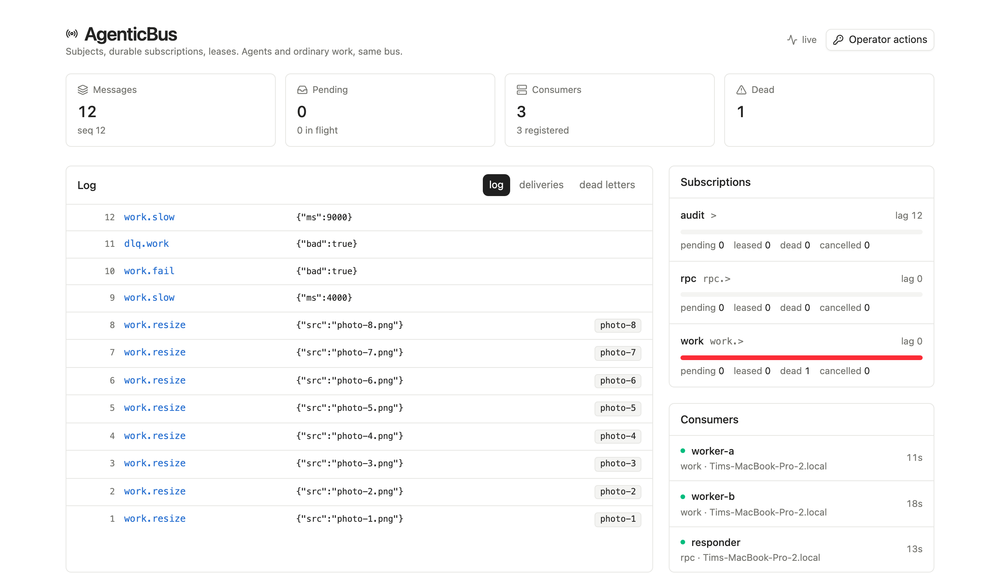

# bql.sh/bus

A durable message bus for agents and ordinary work. Bun, SQLite, no runtime dependencies.

Publish to a subject; durable subscriptions deliver to consumers with leases, retries, ordering and a dead-letter path. Nothing in the core knows what an agent is — agent patterns are conventions over subjects, which is what keeps a plain background job queue a first-class use rather than an afterthought.

```sh
bql-bus serve &
bql-bus subscribe work 'work.>'
bql-bus consume work --exec ./handle.sh &
bql-bus publish work.resize '{"src":"a.png"}'
```

Three things at once, from one set of primitives:

| | |
| --- | --- |
| **Work queue** | Competing consumers on one subscription, at-least-once, leases and fencing |
| **Pub/sub** | Many subscriptions on one subject, each with its own cursor, so a message fans out |
| **Request/reply** | A durable response addressed by correlation — ask now, collect after a restart |

## Install

Bun 1.4 or newer.

The bus is a subpath of one package, `bql.sh`, and its binary is `bql-bus`. Installing the package
installs both halves; nothing here requires the database.

```sh
bun add bql.sh
bunx bql-bus serve &
bunx bql-bus subscribe work 'work.>'
bunx bql-bus publish work.resize '{"src":"a.png"}'
```

The package ships the library, the `bql-bus` binary and the built dashboard, so `serve` has a
UI with nothing else to install.

**Working on the bus itself** runs it from source instead. It lives in the bql.sh monorepo
alongside [`bql.sh`](../db) — see [docs/monorepo.md](../../docs/monorepo.md) for why:

```sh
git clone https://github.com/TimMikeladze/bql && cd bql
bun install                # the whole workspace, one lockfile

bun run bus build          # the library bundle and the dashboard
bun run bus dev
bun run bus test
```

`bun run bus <script>` forwards from the repository root to this package. From inside
`packages/bus`, every script still runs by its own name — `bun run build`, `bun run dev`.

`bun run dev` starts the bus, three consumer processes and the dashboard, choosing free ports rather than fighting for taken ones.

```sh
bun src/cli/index.ts publish work.slow '{"ms":2000}'
bun src/cli/index.ts request rpc.upper '"hello"'
bun src/cli/index.ts stats
```



**The dashboard is read-only until you hand it a token.** The one the bus injects is a `reader`
token — a page that can be opened is not a page that can dispatch work. Pausing, replaying,
purging and requeueing appear once you paste an admin token into **Operator actions**, which is
kept in `sessionStorage` and dies with the tab.

## Subjects

Dot-separated tokens. `*` matches exactly one token, `>` matches one or more trailing tokens — the NATS convention, because people already know it.

```
orders.eu.created        a concrete subject
orders.*.created         matches orders.eu.created, not orders.eu.west.created
orders.>                 matches both
>                        everything
```

## Fan-out happens on pull, not on publish

A subscription holds a cursor into the log. When a consumer asks for work, the bus reads forward from that cursor and creates deliveries for the messages that match.

Three consequences worth knowing:

- **Publishing is O(1)** in the number of subscriptions. Adding the fiftieth subscriber costs producers nothing.
- **A subscription created today can read last week**, with `deliverFrom: "beginning"` or any sequence number.
- **A wall of unrelated subjects cannot starve a subscription.** The cursor advances past messages it examined and did not match, so they are never looked at again. Matching *after* a `LIMIT` — the obvious implementation — is a liveness bug that only appears once you have more than a couple of subjects.

## Delivery

At-least-once by default, with **three named tiers of exactly-once** available on top —
[docs/exactly-once.md](docs/exactly-once.md) is the whole story, and the short version is below.

- A delivery is leased to one consumer for the subscription's `ackWaitMs`, with a monotonic `generation`. An ack or nack from a stale generation is rejected.
- An expired lease returns the delivery to the queue for another consumer, up to `maxAttempts`.
- Exhausting attempts **dead-letters onto an ordinary subject** (`dlq.<subscription>` by default) with the reason in the headers — so a DLQ is just another subscription, and a replay is just another publish. `bql-bus dlq <subscription>` lists them and `dlq requeue <seq>` republishes one onto the subject it failed on, with the `dlq-*` headers stripped and `requeued-from` added. A requeued message is an ordinary new message with its own sequence number: if it fails again it dead-letters again, which is the honest outcome.
- `dedupeKey` is unique per workspace: publishing the same key twice returns the first message, and a deduplicated *request* is handed back the original correlation, so it waits on the answer that will actually arrive.
- Every envelope carries `idempotencyKey` (`<subscription>:<seq>`), stable across redeliveries, and `fence` (`<deliveryId>:<generation>`), which identifies *this attempt* — so a destination with a conditional write can reject a writer whose lease has moved on.
- **Retries are paced.** Per-subscription `backoff` with full jitter, applied on a nack *and* on a reclaimed lease. Full jitter rather than equal jitter, because the failure mode is a fleet retrying in lockstep.
- **Priority classes** (−2…2) and **delayed publish** (`delayMs` / `deliverAt`) — scheduled work and retry-later without a second system.
- **`maxInFlight`** caps what one subscription can have leased, so a misconfigured `prefetch` cannot take the whole backlog into a process that is about to die.
- **Poison quarantine**: a subscription whose dead rate crosses a threshold pauses itself and says so, instead of finishing the backlog into the DLQ at full speed.

**Exactly-once, in three tiers.** End-to-end exactly-once against an arbitrary external system is
not achievable and is not claimed. What is:

| Tier | Guarantee | Requires |
| --- | --- | --- |
| **Transactional ack** | Exactly-once *processing* — the handler's writes and the ack are one SQLite transaction | Embedded mode (`createBus`), a synchronous handler |
| **Atomic read-process-write** | Exactly-once *within the bus* — `ack(id, { publish: [...] })` commits both or neither | Nothing; it is an option on `ack` |
| **Fenced, ledgered effects** | Tight effectively-once against the outside world | A destination with a conditional write, or an idempotent one |

The first exists *because* of the single-writer design, not despite it. The third leaves one
window — a crash between "the external call succeeded" and "the result was recorded" — which is
[named and not hidden](docs/exactly-once.md#the-window-this-does-not-close).

An ack is also **idempotent for the consumer that made it**: a retry after a lost response
replays the original outcome instead of answering 409, which is how a lost response stops being a
duplicated side effect.

**Ordering.** `ordered: true` means only the *head* of a key may be leased — not merely "nothing
leased for this key", which let a message that was waiting out its retry backoff be overtaken by
the next one. Per-key FIFO, with unrelated keys still moving in parallel. Off by default, because
ordering costs throughput and most work does not need it.

When an ordered key's message dead-letters, `onFailure: 'block'` (the default) **stalls that key
and only that key** until an operator requeues or skips it. Letting the next message through is
exactly the reordering `ordered: true` was bought to prevent. `bql-bus blocked <subscription>`
lists them; `unblock` or `dlq requeue` releases one.

**Cancellation.** `bql-bus cancel <seq>` stops a message: every unfinished delivery of it moves to a fourth terminal status, `cancelled`, and no subscription will create a new one — including a subscription whose cursor has not reached it yet.

A consumer already running the work learns on its **next lease renewal**, which answers `{cancelled: true}` rather than failing. `BusConsumer` aborts the handler's `signal`, and `--exec` passes that signal to the child process, so the work actually stops rather than a row merely changing colour. Cancelled deliveries are neither acked nor nacked and are never retried.

Cancelling is the **publisher's** call, or an admin's — the bus records which token published each message. A consumer cannot cancel its own work, because a consumer that could make a message it disliked disappear is a very quiet way to lose work.

## Schemas

A registry of JSON Schema 2020-12 documents, bound to subject *patterns*, with an own validator —
no `ajv`, because the bus ships as one binary with no runtime dependencies.

```sh
bql-bus schema register order ./order.json --compat backward
bql-bus schema bind 'orders.>' order --mode warn      # then --mode enforce
bql-bus schema check order ./order-v2.json            # dry-run the compat check
```

Two decisions carry the feature:

- **Registration rejects any keyword the validator does not implement.** A validator that quietly
  ignores `if`/`then` reports a document as valid when the rule the author wrote was never
  checked. A loud gap beats a quiet hole. `GET /api/schemas/keywords` lists what this build
  enforces.
- **Compatibility is computed, not documented.** `backward | forward | full | none`, checked
  structurally at registration against the previous version — a newly required property, a
  narrowed type, a shrunk enum, a tightened bound. Registering a version that breaks the declared
  mode is a 409 naming the pointer. Schemas without compat checking are paperwork.

`warn` publishes and stamps `schema-invalid` on the envelope, so a schema can be introduced
against live traffic. `enforce` answers 422 with the failing JSON Pointer. A message already in
the log cannot be un-published, so a delivery that fails an enforced schema **dead-letters** with
`dlq-reason: schema` — the only correct move once the write has happened.

Full details, including the keyword list: [docs/schemas.md](docs/schemas.md).

## Durability

- **Blob writes are atomic and fsynced** — temporary file, `fsync`, `rename`, `fsync` the
  directory — and the row records `body_sha256` and `body_bytes`, verified on read. A truncated
  blob is an error naming the handle, never a half-message handed to a handler.
- **A message whose blob is gone dead-letters** instead of failing every claim forever. The
  startup scan reports how many; the claim path handles the rest.
- **The WAL has a ceiling**: `wal_autocheckpoint`, plus a `wal_checkpoint(TRUNCATE)` on the sweep
  once it passes a threshold. `bql_bus_wal_bytes` and `bql_bus_db_bytes` are gauges.
- **A nearly full disk is a policy, not undefined behaviour.** Below the watermark `/api/publish`
  answers **507** with a machine-readable reason and `/ready` goes 503 — while claims and acks keep
  working, because a full disk is exactly when consumers need to drain.
- **A backup is not a backup until it has been restored.** `bql-bus restore <dir> --data <dir>`
  restores and then *opens* the result; `bun run drill:restore` does the whole round trip and
  compares the log, the cursors and the blob bytes. `--until-seq` / `--until-time` stop the
  restore short of the end, for when the thing to undo is a batch somebody published rather than
  a disk that died.

## Observability

- **W3C `traceparent` end to end.** A publish that arrives without one starts a trace; every
  message carries it in its headers, and a reply or an `api.emit` continues it. A message crossing
  three consumers is one trace rather than three unrelated ones.
- **An OTLP/HTTP exporter in one ~200-line file**, behind `--otlp-endpoint`, written rather than
  depended on — the wire format is a public specification and `fetch` is built in. Fire-and-forget: a collector that is down costs dropped spans and a log line,
  never a 500.
- **Histograms that answer the real question**: publish and ack latency, **delivery age at claim**
  and **end-to-end age at ack**. Age is the number that says the bus is behind; a fast claim of an
  hour-old message is still an hour late.
- **Gauges**: per-subscription lag, DLQ depth, in-flight, oldest pending age; WAL, database and
  free-disk bytes; replication lag.
- **`/metrics` is no longer admin-only.** Admin scrapes the install; a workspace-pinned **reader**
  token gets only its own workspace's series and none of the install-wide disk numbers.

## Writing a consumer

```ts
import { BusClient, BusConsumer, FatalError } from "bql.sh/bus/client";

const client = new BusClient({ url: "http://127.0.0.1:4317", token: process.env.BUS_TOKEN! });

await new BusConsumer({
  client,
  id: "resizer-1",
  subscription: "work",
  prefetch: 4,
  async handle({ message }, api) {
    if (!supported(message.body)) throw new FatalError("unsupported format");
    await api.extend();               // renew the lease from a long handler
    return { ok: true };              // a returned value answers a request
  },
}).start();
```

Return normally and the message is acked. Throw and it is nacked, retried with the subscription's
backoff, and eventually dead-lettered. Throw `FatalError` to dead-letter immediately, because a
message this consumer can never handle should not be tried four more times.

The handler API also carries the exactly-once machinery:

```ts
async handle({ message }, api) {
  // Committed with the ack, not before it: a crash cannot produce this message
  // without also finishing the one that caused it.
  api.emit({ subject: "thumbnails.ready", body: { id: message.body.id } });

  // At most once, with the result recorded alongside the ack. A redelivery
  // replays it instead of charging the card again.
  const charge = await api.effect(`charge:${message.body.orderId}`, () =>
    payments.charge(message.body),
  );

  // This attempt, for a conditional write at the destination.
  await store.put(key, bytes, { ifMatch: api.fence });
}
```

**Shutdown hands work back.** `consumer.stop()` aborts in-flight handlers and nacks their
deliveries with *no* delay, so another consumer picks them up at once. Letting the leases expire
instead costs one `ackWaitMs` of dead time per in-flight message on every deploy, for nothing.

Set `handlerTimeoutMs` (or `--exec-timeout`) on anything that could hang. The loop renews the lease for as long as a handler is pending, so the mechanism that protects slow work protects stuck work just as well — without a timeout, a wedged handler holds its message indefinitely.

If the message carried a `reply-to`, whatever the handler returns becomes its response — an RPC consumer is an ordinary consumer that happens to return a value.

**Embedded mode** is the other direction: the bus in your own process, no socket, and the handler
writing to the same SQLite file — which is what makes the ack genuinely transactional.

```ts
import { createBus } from "bql.sh/bus";

const bus = createBus({ path: "./data/bus.db", blobDirectory: "./data/blobs" });
bus.store.raw().run("CREATE TABLE IF NOT EXISTS processed (seq INTEGER PRIMARY KEY)");

bus.consumeTransactional({
  subscription: "work",
  // Synchronous, and that is load-bearing: an `await` in here would let another
  // statement interleave into the transaction this exists to provide.
  handle: (envelope, db) => {
    db.run("INSERT INTO processed (seq) VALUES (?)", [envelope.message.seq]);
  },
});
```

**In any other language**, `--exec` is the whole integration: the message arrives on stdin, and stdout becomes the reply.

```sh
bql-bus consume work --exec ./resize.sh --prefetch 4
```

## CLI

| | |
| --- | --- |
| `bql-bus serve` | run the bus |
| `bql-bus token --consumer id --publish 'a.>' --subscribe work` | mint a scoped token |
| `bql-bus publish <subject> <json>` | publish |
| `bql-bus request <subject> <json>` | publish and wait for a reply |
| `bql-bus subscribe <name> <pattern>` | create a durable subscription |
| `bql-bus consume <subscription> --exec CMD [--exec-timeout ms]` | run a consumer |
| `bql-bus cancel <seq>` | stop a message; in-flight handlers abort |
| `bql-bus dlq <subscription>` · `dlq requeue <seq…>` | inspect and requeue dead letters |
| `bql-bus blocked <subscription>` · `unblock <sub> <key>` | ordered keys stalled behind a dead letter |
| `bql-bus schema register <name> <file>` · `check` · `bind` · `list` | the registry |
| `bql-bus keys rotate` · `keys retire <kid>` | signing keys, with an overlap window |
| `bql-bus revoke <jti>` · `quota [set]` · `audit` | tenant safety |
| `bql-bus follow <upstream>` · `promote --lease <path>` · `cluster` | continuity |
| `bql-bus backup <dir>` · `restore <dir> --data <dir>` | a consistent copy, and the proof it restores |
| `bql-bus tail` · `stats` | follow the log; subscriptions, consumers, lag |

## HTTP API

Every route is reachable as `/api/v1/...` as well as `/api/...`, and the version may arrive as an
`x-bus-api-version` header instead — so a broker and its clients can skew during a rolling deploy
rather than moving in lockstep. A client asking for a version this broker does not speak gets a
400 saying so, not a response it will misread.

| Method | Path | |
| --- | --- | --- |
| `POST` | `/api/publish` | `{subject, key?, headers?, body, dedupeKey?, replyTo?, ttlMs?}` |
| `POST` `GET` | `/api/subscriptions` | create; list |
| `POST` | `/api/subscriptions/:name/claim` | `{consumer, max, waitMs}` — long-polls |
| `POST` | `/api/subscriptions/:name/replay` `/purge` `/pause` | operator actions |
| `POST` | `/api/deliveries/:id/ack` `/nack` `/extend` | `/extend` answers `{cancelled}` too |
| `POST` | `/api/messages/:seq/cancel` · `/api/deliveries/:id/cancel` | stop work; publisher or admin |
| `POST` `GET` | `/api/requests[/:correlation]` | request/reply, both long-polling |
| `GET` | `/api/messages/:seq` · `/api/log[?subject=&newest=]` · `/api/stream` | the log; SSE refresh signal |
| `POST` | `/api/messages/:seq/requeue` | republish a dead letter onto its original subject |
| `POST` `GET` | `/api/consumers/register` · `/api/consumers` · `/api/stats` | fleet |
| `POST` | `/api/subscriptions/:name/unblock` · `GET /blocked` | ordered keys stalled behind a dead letter |
| `POST` `GET` | `/api/effects/claim` · `/api/effects/record` | the effect ledger (Tier 3) |
| `POST` `GET` | `/api/schemas` · `/check` · `/bindings` · `GET /keywords` | the registry |
| `POST` | `/api/tokens` · `/api/tokens/revoke` | mint; revoke by `jti` (admin) |
| `POST` `GET` | `/api/quota` · `GET /api/audit` | per-workspace ceilings; the audit trail |
| `GET` | `/metrics` | Prometheus text. Admin gets the install; a workspace-pinned **reader** gets only its own series |
| `GET` | `/health` · `/ready` | no token; `/ready` is 503 while draining |

## Operating it

[docs/operations.md](docs/operations.md) is the whole story: what to scrape, what to alert on,
how a backup is taken and restored, and what the fleet does afterwards. The short version:

```sh
bql-bus serve --log-level info --log-format json
curl -H "Authorization: Bearer $ADMIN" localhost:4317/metrics
bql-bus backup /backups/$(date +%F)
```

**SIGTERM drains.** The bus stops handing out work first — a claim answers empty rather than
holding the consumer for the rest of its long poll — then lets parked polls return, then finishes
requests in flight, and only then closes the database. `bun run soak --term-bus` is the check:
SIGTERM in the middle of five thousand messages, restart, nothing lost.

**Counters live in the store, gauges are read at scrape time.** A gauge only written when
something moves is stale exactly when it matters: an idle subscription with a thousand pending
deliveries would keep reporting whatever it last reported.

## Security

**Scoped tokens.** A token names its workspace, the subject patterns it may publish to, and the subscriptions it may claim from. Grants are patterns, so `orders.>` licenses everything beneath it. Verification is a signature check plus one **local index probe** — no network, no round trip — which is what makes revocation affordable without giving up what stateless tokens were worth.

**Revocation and rotation.** Every token carries a `jti`; `bql-bus revoke <jti>` withdraws one, and the entry is dropped once the token would have expired anyway. Keys carry a `kid` and rotate with an overlap window — `bql-bus keys rotate`, then `keys retire <kid>` once the old tokens have expired — so rotating does not invalidate the whole fleet at one instant.

**Rate limits and quotas.** Token-bucket limits on publish and claim (`--publish-rate`, `--claim-rate`) answer **429 with `Retry-After`**, and `--max-polls` caps how many long polls one token may park so a single consumer cannot occupy the server's poll budget. Per-workspace quotas (`bql-bus quota set --messages --bytes --subscriptions`) exist because one tenant must not be able to fill the disk every other tenant's durability depends on. All off by default: a limit set without knowing the workload is how a healthy fleet gets throttled at 3am.

**Audit trail.** Append-only. Who published, cancelled, purged, replayed, paused, minted, revoked, bound a schema — with the token subject and a timestamp. `bql-bus audit`. Operator actions without a trail are not operable, they are just powerful.

**Three scopes.** `admin` publishes anywhere, manages subscriptions and mints tokens. `consumer` publishes and claims within its grants. `reader` observes, and is what the dashboard is given — a page that can be opened is not a page that can dispatch work.

**Tenancy is enforced, not decorative.** `workspace` is a mandatory filter on every query, and a non-admin token is pinned to its own: it cannot name another one in a header.

**The signing key and admin token live in `.bql-bus/` at mode 0600**, not in argv where `ps` would show them.

**Transport is the operator's job.** A bearer token must not cross an untrusted network in plaintext: terminate TLS or use a tunnel. The bundled `Dockerfile` and `fly.toml` do exactly that — the platform terminates TLS, and the bus binds `0.0.0.0` only because a container must, never as a changed default. See [docs/operations.md](docs/operations.md#deploying).

## Verify

From `packages/bus`. Prefix any of them with `bun run bus` to run it from the repository root
instead.

```sh
bun run typecheck
bun test tests           # 137 across 13 files
bun run build
bun run test:e2e
bun run verify-pack
bun run build:binary      # one file per target, plus checksums
bun run test:compiled     # the same e2e, against the compiled binary
bun run drill:restore     # publish → backup → wipe → restore → compare
bun run drill:failover    # promote under load; the old leader is fenced out
```

`verify-pack` is the one that catches what the others cannot: it packs the tarball, installs it
into an empty directory, imports every advertised entry point and starts a bus from the installed
copy. A bundler can drop a module and still emit its name in the export list — that failure would
otherwise surface in someone else's install.

The end-to-end check is real processes and no mocks — competing consumers, fan-out, a consumer **SIGKILLed mid-message**, a poison message, and a request answered from another process:

```
ok   eight messages were handled with none left pending or dead — pending=0 dead=0
ok   a second subscription received the same messages independently — 8 envelopes
ok   killed worker-a while it held the slow message
ok   a surviving consumer recovered the expired lease — attempt 2, now on worker-b
ok   the poison message reached the dead-letter subject with its reason — unsupported payload
ok   a request was answered by a consumer in another process — "HELLO BUS"
ok   a long handler is running as a real child process — pid 86892
ok   cancelling the message cancelled its in-flight delivery — 1 delivery
ok   the consumer's child process actually stopped
ok   a repeated dedupe key does not publish twice
```

And `bun run soak` is the contention check the unit tests cannot be: eight consumer processes racing on one subscription, 5000 messages, consumers SIGKILLed throughout, asserting every message was handled at least once and acked exactly once with nothing left pending. `--ordered` adds per-key FIFO under kills; `--kill-bus` kills the broker itself mid-flight.

```sh
bun run soak
bun run soak --ordered
bun run soak --kill-bus --repeat 10
bun run soak --poison 0.05              # backoff bounds the retry rate; nothing hot-loops
bun run soak --ordered --poison 0.05    # a dead key blocks, and nothing overtakes it
bun run soak --fault blob-write         # crash between the blob write and the row commit
bun run soak --fault mid-txn            # crash inside the publish transaction
bun run soak --fault post-ack           # crash after the ack commits, before the response
```

The `--fault` runs are deterministic crash points rather than a kill at a random moment, which is
the difference between proving the bus survives *a* crash and proving it survives *the* crash. The
`post-ack` run is the one that shows the idempotent ack earning its keep: the response is lost,
the consumer retries, and the message is **not** handled a second time.

`--ordered --poison` is what found a real ordering hole during this work: a message waiting out
its retry backoff is not leased, so "nothing leased for this key" let the next message overtake
it. The claim now moves only the *head* of a key.

## dagr

[dagr](https://github.com/TimMikeladze/dagr) is a workflow engine that runs one process against one SQLite journal, and says so plainly: multi-process execution is out of scope, because its single writer is load-bearing. `dagr-remote` closes that gap by putting this bus between the engine and its handlers — a step declares `runtime: remote`, the request goes onto a subject, and a consumer on another machine answers it.

```yaml
review:
  kind: task
  runtime: remote
  with:
    run: agent
    input: { prompt_file: ./prompts/review.md, model: claude-opus-5 }
```

That package lives in dagr's repository and depends on this one. **The bus has no dependency on dagr** — it is one client among many, and nothing about workflows leaks into the core.

## Boundaries

One process owns one SQLite file in WAL mode. Consumers never open it; they hold leases over HTTP, and every claim is a conditional `UPDATE` that only transitions *out of* `pending`, so two consumers racing for one delivery is safe rather than merely unlikely.

**Continuity, and what it is not.** `bql-bus follow <upstream> --data ./replica` replicates the
**bus log** — not the SQLite WAL — so a follower rebuilds from `/api/log?after=N` plus the
subscription cursors. It survives a schema change, needs no frame parsing, and is one ~220-line
file rather than a project. Leases are deliberately *not* replicated: they are ephemeral, and a
promoted follower re-materializes deliveries from cursors through the same code path a cold start
already uses.

`bql-bus promote --lease <path>` acquires a lease in storage both nodes can see and stamps an
incrementing **epoch**. The old leader, running with the same `--lease`, sees the epoch move and
**stops accepting writes**. Split brain is prevented by the fence, not by hoping the old node is
dead.

Replication is **asynchronous**, so a failover loses up to the current lag. That is a number, not
a hope: `bql-bus.replication.lag_seq` and `lag_ms` are gauges, `bun run drill:failover` prints
the RPO it measured, and on a laptop under continuous publish it lands in the **tens of
messages**. Alert on the gauges; the number you tolerate is the promise you are making.

Still one writer. This buys continuity and read scale-out, **not** write scale-out.

The honest ceiling: this is right for a fleet, and for infrastructure a dozen services depend on
it is a deliberate trade — one writer, asynchronous replication, an RPO you have to state. Raft,
multi-writer and synchronous replication are out of scope on purpose. The store sits behind a
seam so a different backend is a swap rather than a rewrite.

Also not implemented: consensus, active/active, or exactly-once against an arbitrary external
system — [Tier 3's window](docs/exactly-once.md#the-window-this-does-not-close) is the floor, not
a temporary state.

## Design

- [A message bus for agents and ordinary work](docs/superpowers/specs/2026-09-12-message-bus.md) — the current design and why it is shaped this way.
- [Finishing bql.sh/bus](docs/superpowers/specs/2026-09-13-finishing.md) — schema versioning, cancellation, operability, packaging and the decisions behind them.
- [Production bql.sh/bus](docs/superpowers/specs/2026-09-13-production.md) — schemas, exactly-once, durability and continuity: the plan, and what landed against it.
- [Exactly-once, in three tiers](docs/exactly-once.md) — what each tier guarantees, what it costs, and where the last one stops.
- [Schemas](docs/schemas.md) — the supported JSON Schema subset, and why an unsupported keyword is an error.
- [Running it](docs/operations.md) — metrics, logging, shutdown, backup and restore.
- [What was verified](docs/FINISHING-REPORT.md) — how each claim was checked, and what still is not.
